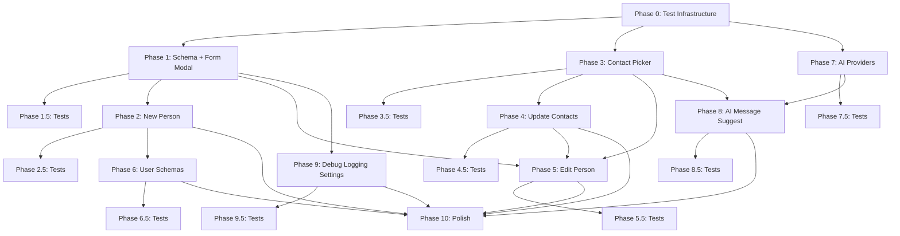

---
tags:
  - projects
  - orbit
  - implementation
created: 2026-02-13
status: in-progress
---
# Orbit UX Overhaul — Implementation Plan

> **Goal:** Replace manual contact management with native Orbit modals, add a user-extensible schema system, and integrate AI-powered message suggestions.
>
> Each phase is scoped to fit within a single agent session (~1-3 hours of focused work). Phases are sequential — each builds on the previous. Each implementation phase (1-10) is followed by a testing sub-phase (X.5) that adds unit and integration tests targeting **≥80% coverage** on the code introduced in that phase.

---

## Architecture Overview

### Hub-and-Spoke Architecture (Core Principle)

All shared logic lives in centralized utilities. Services and components import from these hubs — never duplicate logic across files.

```
src/utils/
├── logger.ts          # [NEW] Centralized Logger (created Phase 1, settings wired Phase 9)
├── dates.ts           # [NEW] formatLocalDate(), date utilities
└── paths.ts           # [NEW] sanitizeFileName(), normalizePath wrappers
```

**Rules:**
- **Date formatting** → always use `formatLocalDate()` from `utils/dates.ts` (never `toISOString().split('T')[0]` — it returns UTC, causing off-by-one bugs at night)
- **File path construction** → always use `normalizePath()` + `sanitizeFileName()` from `utils/paths.ts`
- **Logging** → always use `Logger` from `utils/logger.ts` (never raw `console.log`)
- **Settings** → single source of truth, services read from it

### Test Infrastructure (see Phase 0)

```
test/
├── setup.ts                         # Global test setup (Obsidian API mocks)
├── mocks/
│   ├── obsidian.ts                  # Mock: App, Vault, MetadataCache, TFile, etc.
│   └── react-dom.ts                 # Mock: createRoot for modal tests
├── helpers/
│   └── factories.ts                 # Test factories for OrbitContact, SchemaDef, etc.
├── unit/
│   ├── types.test.ts                # Phase 0 baseline tests
│   ├── orbit-index.test.ts          # Phase 0 baseline tests
│   ├── schemas/
│   │   ├── types.test.ts            # Phase 1.5
│   │   └── loader.test.ts           # Phase 6.5
│   ├── services/
│   │   ├── contact-manager.test.ts  # Phase 2.5
│   │   └── ai-service.test.ts       # Phase 7.5
│   └── ...
└── integration/
    ├── new-person-flow.test.ts      # Phase 2.5
    ├── update-flow.test.ts          # Phase 4.5
    ├── edit-flow.test.ts            # Phase 5.5
    ├── user-schema-flow.test.ts     # Phase 6.5
    └── ai-suggest-flow.test.ts      # Phase 8.5
```

### Source Structure

```
src/
├── main.ts                          # Plugin entry (add commands)
├── settings.ts                      # Settings tab (expand for AI, schemas)
├── types.ts                         # Core types (extend as needed)
├── utils/
│   ├── logger.ts                    # [NEW] Gated debug logging system
│   ├── dates.ts                     # [NEW] formatLocalDate(), parseDate helpers
│   └── paths.ts                     # [NEW] sanitizeFileName(), normalizePath wrappers
├── schemas/
│   ├── types.ts                     # [NEW] Schema interfaces (FieldDef, SchemaDef)
│   ├── new-person.schema.ts         # [NEW] Built-in: New Person
│   ├── edit-person.schema.ts        # [NEW] Built-in: Edit Person
│   └── loader.ts                    # [NEW] Schema loader (TS + Markdown)
├── modals/
│   ├── ReactModal.ts                # [NEW] Base modal class — handles createRoot/unmount lifecycle
│   ├── OrbitFormModal.ts            # [NEW] Generic schema-driven form modal (extends ReactModal)
│   ├── ContactPickerModal.ts        # [NEW] Card grid picker modal (extends ReactModal)
│   └── AiResultModal.ts            # [NEW] AI message result modal (extends ReactModal)
├── services/
│   ├── OrbitIndex.ts                # Existing (modify: contactsFolder support)
│   ├── LinkListener.ts              # Existing (no changes expected)
│   ├── ContactManager.ts            # [NEW] File creation, frontmatter writes, template engine
│   └── AiService.ts                 # [NEW] AI provider abstraction + generation
├── components/
│   ├── ContactCard.tsx              # Existing (reused in modals)
│   ├── ContactGrid.tsx              # Existing (reused in picker)
│   ├── FormRenderer.tsx             # [NEW] React form renderer (field types)
│   ├── ContactPickerGrid.tsx        # [NEW] Card grid for modal context
│   ├── UpdatePanel.tsx              # [NEW] Inline update form
│   └── AiResult.tsx                 # [NEW] AI result display (copy, regen, dismiss) — JSX only, no innerHTML
├── context/
│   └── OrbitContext.tsx             # Existing (no changes expected)
└── views/
    ├── OrbitView.tsx                # Existing
    └── OrbitDashboard.tsx           # Existing
```

### Key Architecture Decisions

| Decision | Choice |
|----------|--------|
| Modal rendering | `ReactModal` base class → `createRoot()` in `onOpen()`, `root.unmount()` in `onClose()` |
| Schema format (built-in) | TypeScript files, compiled with plugin |
| Schema format (user) | Markdown: YAML frontmatter for fields, body for output template |
| Contact picker | Reuses existing `ContactCard` component inside modal |
| Update flow | Click card → inline update panel → save → return to grid |
| AI providers | Default: None (disabled). Ollama, OpenAI, Anthropic, Google, Custom endpoint |
| AI API keys | Investigate Obsidian Keychain API first; fallback to `data.json` with user warning |
| HTTP requests | Use Obsidian's `requestUrl()` (not `fetch()`) — handles CORS + mobile |
| Source of truth | File frontmatter is canonical; `orbit-state.json` is derived |
| Testing | vitest + Obsidian API mocks, ≥80% coverage per phase, X.5 sub-phases |
| Logging | Gated `Logger` utility — no raw `console.log` in new code |
| File paths | All paths through `normalizePath()` + `sanitizeFileName()` |
| UI rendering | JSX only in all new components — no `innerHTML` / `dangerouslySetInnerHTML` |
| Settings UI | Use `setHeading()` API, sentence case, no top-level "General" heading |
| Contact scanning | `contactsFolder` setting for targeted scanning (empty = full vault fallback) |
| Active file detection | `getActiveViewOfType(MarkdownView)?.file` (not `activeLeaf`) |
| Command IDs | Bare IDs only — Obsidian auto-prefixes with plugin ID |

### Obsidian Plugin Review Compliance

> [!IMPORTANT]
> The following items are required for Obsidian community plugin store submission and must be verified before release:

- **Command IDs**: Do not include plugin ID prefix (Obsidian adds it automatically)
- **Manifest description**: Must end with `.`, start with action verb, ≤250 chars, no emoji
- **No innerHTML**: Use `createEl()`/JSX for DOM manipulation (existing `FuelTooltip.tsx` needs fixing)
- **No console.log**: Only `console.error()` for actual errors; use `Logger` utility for debug output
- **Network disclosure**: AI features must require explicit opt-in; README must disclose data sent to external services
- **normalizePath()**: Required on all user-derived or constructed file paths
- **Settings headings**: Use `Setting` API's `setHeading()` with sentence case
- **requestUrl()**: Required for all HTTP calls (not raw `fetch()`)
- **Manifest version**: Must match project version (`v0.9.0`)

---

## Phase 0: Test Infrastructure & Baseline Tests ✅

**Goal:** Set up vitest with Obsidian API mocks and write baseline tests for the most important existing code.

### Deliverables
- Install vitest + dependencies (`vitest`, `@testing-library/react`, `jsdom`, `c8`/`v8` coverage)
- `vitest.config.ts` — Config with jsdom environment, coverage thresholds, path aliases
- `test/setup.ts` — Global setup (DOM polyfills if needed)
- `test/mocks/obsidian.ts` — Mocks for Obsidian API: `App`, `Vault`, `TFile`, `MetadataCache`, `Plugin`, `Modal`, `Notice`, `Menu`, `Events`, `processFrontMatter`, etc.
- `test/helpers/factories.ts` — Factory functions for creating test `OrbitContact`, `TFile`, `CachedMetadata` objects
- `package.json` — Add `test`, `test:coverage` scripts
- `tsconfig.json` — Ensure test files are included in compilation (or separate `tsconfig.test.json`)

### Baseline Tests (Existing Code)

These tests lock down the existing behavior before we start modifying anything:

| Test File | Target | Tests |
|-----------|--------|-------|
| `test/unit/types.test.ts` | `src/types.ts` | `calculateStatus` (all status transitions), `calculateDaysSince`, `calculateDaysUntilDue`, `parseDate` (valid/invalid/edge cases), `isValidFrequency` |
| `test/unit/orbit-index.test.ts` | `src/services/OrbitIndex.ts` | `initialize`, `scanVault`, `parseContact` (valid/missing fields/ignored paths), `hasPersonTag`, `handleFileChange`, `handleFileDelete`, `handleFileRename`, `getContacts`, `getContactsByStatus` |
| `test/unit/link-listener.test.ts` | `src/services/LinkListener.ts` | Debounce behavior, wikilink detection regex, index cross-reference, duplicate detection (same-day), settings update |

### Obsidian Mock Strategy

The Obsidian API can't be imported in tests. We create a mock module that vitest resolves via `moduleNameMapper`:

```typescript
// test/mocks/obsidian.ts
export class Plugin {
  app: any;
  registerEvent() {}
  addCommand() {}
  addSettingTab() {}
  addRibbonIcon() {}
  loadData() { return Promise.resolve({}); }
  saveData() { return Promise.resolve(); }
  registerView() {}
}

export class Events {
  private handlers: Map<string, Function[]> = new Map();
  on(event: string, handler: Function) { /* ... */ }
  trigger(event: string, ...args: any[]) { /* ... */ }
}

export class TFile {
  path: string;
  basename: string;
  extension = 'md';
  constructor(path: string) {
    this.path = path;
    this.basename = path.split('/').pop()?.replace('.md', '') ?? '';
  }
}
// ... Modal, Notice, Menu, Setting, etc.
```

### Files to Create/Modify

| File | Action |
|------|--------|
| `vitest.config.ts` | **NEW** — Test configuration |
| `test/setup.ts` | **NEW** — Global test setup |
| `test/mocks/obsidian.ts` | **NEW** — Obsidian API mocks |
| `test/helpers/factories.ts` | **NEW** — Test data factories |
| `test/unit/types.test.ts` | **NEW** — Baseline: type utilities |
| `test/unit/orbit-index.test.ts` | **NEW** — Baseline: OrbitIndex service |
| `test/unit/link-listener.test.ts` | **NEW** — Baseline: LinkListener service |
| `package.json` | **MODIFY** — Add vitest deps + test scripts |

### Verification
- `npm test` runs all tests and passes
- `npm run test:coverage` produces coverage report
- Baseline tests achieve ≥80% line + branch coverage on `types.ts`, `OrbitIndex.ts`, `LinkListener.ts`
- `npm run build` still succeeds (test files don't break production build)

---

## Phase 1: Schema System & Form Modal Foundation ✅

**Goal:** Build the core infrastructure that all subsequent modals depend on, including the `ReactModal` base class.

### Deliverables
- `modals/ReactModal.ts` — Base modal class that handles React root lifecycle:
  - `onOpen()` → creates container div, calls `createRoot()`, renders via abstract `renderContent()` method, wraps in `ErrorBoundary`
  - `onClose()` → calls `root.unmount()`, cleans up container
  - Built-in `ErrorBoundary` component — catches uncaught React errors and shows friendly error UI instead of blank modal
  - All modal subclasses extend this — prevents memory leaks from forgotten cleanup
- `schemas/types.ts` — `FieldDef` and `SchemaDef` interfaces
- `modals/OrbitFormModal.ts` — Generic modal shell (extends `ReactModal`)
- `components/FormRenderer.tsx` — React component that renders fields from a schema
  - **JSX only** — no `innerHTML` or `dangerouslySetInnerHTML` for help text/descriptions
- Supported field types: `text`, `textarea`, `dropdown`, `date`, `toggle`, `number`
- CSS: Base form modal styles, layout hints (`full-width`, `half-width`, `inline`), `cssClass` support
- Smoke test: Register a temporary command that opens the form modal with a hardcoded test schema
- `src/utils/dates.ts` — `formatLocalDate()` utility (replaces `toISOString().split('T')[0]`)
- `src/utils/paths.ts` — `sanitizeFileName()` and `normalizePath()` wrappers
- `src/utils/logger.ts` — `Logger` utility class with severity-gated output (defaults to `'off'` — no output until settings wire it in Phase 9)

### ReactModal Base Class

```typescript
// src/modals/ReactModal.ts
import { Modal, App } from 'obsidian';
import { createRoot, Root } from 'react-dom/client';
import React from 'react';

class ModalErrorBoundary extends React.Component<
  { children: React.ReactNode },
  { error: Error | null }
> {
  state = { error: null as Error | null };
  static getDerivedStateFromError(error: Error) { return { error }; }
  render() {
    if (this.state.error) {
      return <div className="orbit-error">Something went wrong: {this.state.error.message}</div>;
    }
    return this.props.children;
  }
}

export abstract class ReactModal extends Modal {
  private root: Root | null = null;

  constructor(app: App) {
    super(app);
  }

  onOpen() {
    const { contentEl } = this;
    contentEl.empty();
    this.root = createRoot(contentEl);
    this.root.render(
      <ModalErrorBoundary>{this.renderContent()}</ModalErrorBoundary>
    );
  }

  onClose() {
    this.root?.unmount();
    this.root = null;
    this.contentEl.empty();
  }

  /** Subclasses implement this to provide their React tree */
  abstract renderContent(): React.ReactElement;
}
```

### Utility Functions

```typescript
// src/utils/dates.ts
/** Returns local YYYY-MM-DD string (avoids UTC off-by-one from toISOString) */
export function formatLocalDate(date: Date = new Date()): string {
  const y = date.getFullYear();
  const m = String(date.getMonth() + 1).padStart(2, '0');
  const d = String(date.getDate()).padStart(2, '0');
  return `${y}-${m}-${d}`;
}
```

```typescript
// src/utils/paths.ts
import { normalizePath } from 'obsidian';

/** Strips characters invalid for file paths */
export function sanitizeFileName(name: string): string {
  return name.replace(/[\\/:*?"<>|]/g, '').trim();
}

/** Combines normalizePath + sanitizeFileName for user-derived paths */
export function buildContactPath(folder: string, name: string, ext = '.md'): string {
  const cleanName = sanitizeFileName(name);
  return normalizePath(`${folder}/${cleanName}${ext}`);
}
```

### Schema Interface (Draft)

```typescript
interface FieldDef {
  key: string;           // frontmatter key
  type: "text" | "textarea" | "dropdown" | "date" | "toggle" | "number" | "photo";
  label: string;         // display label
  placeholder?: string;
  required?: boolean;
  default?: string | boolean | number;
  options?: string[];    // for dropdowns
  layout?: "full-width" | "half-width" | "inline";
  description?: string;  // help text below the field
}

interface SchemaDef {
  id: string;            // unique identifier
  title: string;         // modal title
  cssClass?: string;     // applied to modal container
  fields: FieldDef[];
  submitLabel?: string;  // button text (default: "Save")
  output?: {
    path: string;        // template path for file creation (e.g., "People/{{category}}/{{name}}.md")
  };
}
```

### Files to Create/Modify

| File | Action |
|------|--------|
| `src/modals/ReactModal.ts` | **NEW** — Base modal with React lifecycle + ErrorBoundary |
| `src/schemas/types.ts` | **NEW** — FieldDef, SchemaDef interfaces |
| `src/modals/OrbitFormModal.ts` | **NEW** — Modal shell extending ReactModal |
| `src/components/FormRenderer.tsx` | **NEW** — Schema-driven form renderer (JSX only) |
| `src/utils/dates.ts` | **NEW** — `formatLocalDate()` utility |
| `src/utils/paths.ts` | **NEW** — `sanitizeFileName()`, `buildContactPath()` |
| `src/utils/logger.ts` | **NEW** — `Logger` utility (defaults to `'off'`, settings wired in Phase 9) |
| `styles.css` | **MODIFY** — Add form modal base styles |
| `src/main.ts` | **MODIFY** — Add temp test command (removed in Phase 2) |

### Verification
- Build succeeds (`npm run build`)
- Temporary command opens modal with test schema
- All field types render correctly
- Layout hints apply proper CSS classes
- Modal sizes to content with reasonable min/max dimensions
- `ReactModal` base class correctly mounts/unmounts React root
- ErrorBoundary catches thrown errors and displays friendly message (not blank modal)
- `Logger` imported and usable (no output by default since level is `'off'`)

---

## Phase 1.5: Schema & Form Modal Tests ✅

**Goal:** ≥80% unit + integration coverage on Phase 1 code.

### Test Files

| File | Type | Covers |
|------|------|--------|
| `test/unit/schemas/types.test.ts` | Unit | `FieldDef` and `SchemaDef` validation logic (if any), type guards |
| `test/unit/modals/react-modal.test.ts` | Unit | `ReactModal` — `createRoot` called on open, `root.unmount()` called on close, container cleanup, ErrorBoundary catches errors and renders fallback |
| `test/unit/modals/orbit-form-modal.test.ts` | Unit | `OrbitFormModal` — schema rendering delegation, submit callback, close behavior |
| `test/unit/components/form-renderer.test.ts` | Unit | `FormRenderer` — renders each field type, layout classes applied, required field validation, default values, onChange callbacks |
| `test/unit/utils/dates.test.ts` | Unit | `formatLocalDate()` — returns local date (not UTC), edge cases near midnight |
| `test/unit/utils/paths.test.ts` | Unit | `sanitizeFileName()` — strips invalid chars; `buildContactPath()` — combines folder + sanitized name |
| `test/unit/utils/logger.test.ts` | Unit | `Logger` — all severity levels gate correctly, `setLevel()`, source prefix formatting |
| `test/integration/form-modal-flow.test.ts` | Integration | Full flow: open modal with schema → fill fields → submit → verify callback receives correct data |

### Coverage Targets
- `schemas/types.ts`: ≥80% lines + branches
- `modals/ReactModal.ts`: ≥80% lines + branches
- `modals/OrbitFormModal.ts`: ≥80% lines + branches
- `components/FormRenderer.tsx`: ≥80% lines + branches
- `utils/dates.ts`: ≥80% lines + branches
- `utils/paths.ts`: ≥80% lines + branches
- `utils/logger.ts`: ≥80% lines + branches

---

## Phase 2: ContactManager Service & New Person Modal ✅

**Goal:** Ship the "New Person" workflow — the highest-value friction removal.

### Deliverables
- `services/ContactManager.ts` — File creation, template loading, frontmatter population
- `schemas/new-person.schema.ts` — Built-in schema for creating a new contact
- `photo` field type in FormRenderer (URL input with live image preview)
- Template engine: Load user-editable template file, inject values via `{{key}}` replacement
  - **Empty fields**: Replace `{{key}}` with empty string — keep the frontmatter key and body line (don't strip them). This ensures users can add values later without reconstructing keys.
- Command: `new-person` (displayed as "Orbit: New Person") in command palette + ribbon
- Remove temporary test command from Phase 1
- Settings: `contactsFolder` — folder for targeted contact scanning (default: `""` = full vault)
  - When empty, show description: "Leave empty to scan entire vault. Setting a folder improves performance on large vaults."

### New Person Schema Fields

| Field | Type | Required | Notes |
|-------|------|----------|-------|
| name | text | ✅ | Used for filename (sanitized via `sanitizeFileName()`) |
| category | dropdown | ✅ | Family, Friends, Work, Community, etc. |
| frequency | dropdown | ✅ | Daily through Yearly |
| social_battery | dropdown | | Charger, Neutral, Drain |
| birthday | date | | MM-DD or YYYY-MM-DD |
| photo | photo | | URL with live preview |
| google_contact | text | | Google Contacts URL |

### ContactManager Responsibilities
- `createContact(schema, formData, templatePath)` — Main entry point
  - Loads template file from vault (falls back to hardcoded default if missing)
  - Populates frontmatter from form data
  - Replaces `{{key}}` placeholders in body (empty optional fields → empty string, key/line preserved)
  - Creates file at `output.path` (via `buildContactPath()` — applies `normalizePath()` + `sanitizeFileName()`)
  - **Post-creation check**: If `contactsFolder` is set and the output path is outside it, show a `Notice`: "Contact created at [path] — this is outside your contacts folder ([folder]). Move it there or update your contacts folder setting to see it in Orbit."
  - Returns the created `TFile`
- `updateFrontmatter(file, data)` — Wrapper around `processFrontMatter` — **merge only**: updates fields defined in the schema, preserves all other existing frontmatter keys
- `appendToInteractionLog(file, entry)` — Uses `vault.process()` (atomic, avoids conflicts with active editor)

> [!NOTE]
> `appendToInteractionLog` uses `vault.process()` instead of `vault.read()` + `vault.modify()`. This is atomic and avoids conflicts when the file is open in the editor.

### Settings Additions
- `templatePath` setting — Path to the person template file in the vault (default: `System/Templates/Person Template.md`)
- `contactsFolder` setting — Folder to scan for contacts (default: `""`)
  - When set, `OrbitIndex.scanVault()` uses `vault.getFolderByPath()` → iterate children (not `getMarkdownFiles()`)
  - When empty, falls back to existing full vault scan behavior
  - Description text: "Leave empty to scan entire vault. Setting a folder improves performance on large vaults."

### OrbitIndex Changes
- Read `contactsFolder` from settings
- When set: use `vault.getFolderByPath(contactsFolder)` → iterate `.children` (targeted scan)
- When empty: fall back to `vault.getMarkdownFiles()` (current behavior)
- Still apply tag filter as secondary check within the folder

### Files to Create/Modify

| File | Action |
|------|--------|
| `src/services/ContactManager.ts` | **NEW** — File creation and template engine (uses `buildContactPath()`, `vault.process()`) |
| `src/schemas/new-person.schema.ts` | **NEW** — New Person schema definition |
| `src/components/FormRenderer.tsx` | **MODIFY** — Add `photo` field type with preview |
| `src/settings.ts` | **MODIFY** — Add `templatePath`, `contactsFolder` settings (use `setHeading()`) |
| `src/services/OrbitIndex.ts` | **MODIFY** — Support `contactsFolder` targeted scanning |
| `src/main.ts` | **MODIFY** — Register `new-person` command, remove test command |
| `styles.css` | **MODIFY** — Photo preview styles |

### Verification
- Build succeeds
- "Orbit: New Person" command opens modal with correct fields
- Photo URL shows live preview after paste
- Submitting creates a properly formatted `.md` file in the right directory
- File path is sanitized (names with special chars don't break)
- Created file appears in Orbit sidebar on next index refresh
- Template file is loaded from vault if it exists, default used if missing
- `contactsFolder` setting: when set, only scans that folder; when empty, scans all
- Creating a contact outside `contactsFolder` shows an informational notice

---

## Phase 2.5: ContactManager & New Person Tests ✅

**Goal:** ≥80% unit + integration coverage on Phase 2 code.

### Test Files

| File | Type | Covers |
|------|------|--------|
| `test/unit/services/contact-manager.test.ts` | Unit | `createContact` (template loading, fallback to default, frontmatter population, `{{key}}` replacement, path resolution via `buildContactPath()`), `updateFrontmatter`, `appendToInteractionLog` (uses `vault.process()`) |
| `test/unit/schemas/new-person-schema.test.ts` | Unit | Schema definition correctness (all fields present, types correct, required flags) |
| `test/unit/components/form-renderer-photo.test.ts` | Unit | `photo` field type — URL input rendering, live preview on value change, broken URL handling |
| `test/unit/services/orbit-index-folder.test.ts` | Unit | `scanVault` with `contactsFolder` set vs empty — targeted vs full scan |
| `test/integration/new-person-flow.test.ts` | Integration | Full flow: open New Person modal → fill fields → submit → verify file created with correct frontmatter + body content |

### Coverage Targets
- `services/ContactManager.ts`: ≥80% lines + branches
- `schemas/new-person.schema.ts`: ≥80% lines + branches
- `components/FormRenderer.tsx` (photo additions): maintains ≥80%

---

## Phase 3: Contact Picker Modal ✅

**Goal:** Build the reusable card-grid picker that the Update, Edit, and AI flows all share.

### Deliverables
- `modals/ContactPickerModal.ts` — Modal shell with card grid (extends `ReactModal`)
- `components/ContactPickerGrid.tsx` — Card grid for modal context (uses `ContactCard`)
- Grid sorted by status: decay → wobble → stable → snoozed
- Optional filter: "Show decaying only" toggle
- Search/filter by name (text input at top)
- Click callback: `onSelect(contact: OrbitContact)` — consumer decides what happens next
- Proper sizing: modal sizes to content, minimum dimensions enforced, max = near full-screen
- Temporary `debug-picker` command for manual verification (removed in Phase 4)

### Component Architecture

```
ContactPickerModal (extends ReactModal)
  └── React Root (managed by ReactModal base class)
      └── ContactPickerGrid
          ├── Search/filter bar
          └── Grid of ContactCard components (reused from sidebar)
              └── onClick → calls onSelect callback
```

### Reusing ContactCard
The existing `ContactCard` component currently handles:
- Avatar with photo/initials fallback
- Status ring (color-coded border)
- Name display
- Click to open note
- Right-click context menu
- Hover for FuelTooltip

For the picker context, we need to:
- Disable the "open note" click behavior (replaced by `onSelect`)
- Disable the right-click context menu
- Disable the FuelTooltip hover
- Keep everything else (avatar, status ring, name)
- Add a prop like `mode?: "sidebar" | "picker"` to toggle behaviors

### Files to Create/Modify

| File | Action |
|------|--------|
| `src/modals/ContactPickerModal.ts` | **NEW** — Picker modal shell (extends `ReactModal`) |
| `src/components/ContactPickerGrid.tsx` | **NEW** — Grid layout for picker |
| `src/components/ContactCard.tsx` | **MODIFY** — Add `mode` prop to toggle sidebar vs picker behavior |
| `styles.css` | **MODIFY** — Picker modal styles, search bar |

### Verification
- Build succeeds
- Temporary `debug-picker` command opens picker modal
- Card grid renders contacts sorted by status
- Search input filters by name
- Click fires `onSelect` callback

---

## Phase 3.5: Contact Picker Tests ✅

**Goal:** ≥80% unit + integration coverage on Phase 3 code.

### Test Files

| File | Type | Covers |
|------|------|--------|
| `test/unit/modals/contact-picker-modal.test.ts` | Unit | Modal opens, creates React root, passes contacts to grid, calls `onSelect` callback |
| `test/unit/components/contact-picker-grid.test.ts` | Unit | Renders contact cards, search filtering, status sorting (decay → wobble → stable → snoozed), empty state |
| `test/unit/components/contact-card-modes.test.ts` | Unit | `ContactCard` with `mode="picker"` — click calls `onSelect` (not open note), no context menu, no tooltip |
| `test/integration/picker-flow.test.ts` | Integration | Open picker → search → select contact → verify `onSelect` fires with correct contact |

### Coverage Targets
- `modals/ContactPickerModal.ts`: ≥80% lines + branches
- `components/ContactPickerGrid.tsx`: ≥80% lines + branches
- `components/ContactCard.tsx` (mode changes): maintains ≥80%

---

## Phase 4: Update Contacts Flow

**Goal:** Wire the contact picker to an inline update panel. This replaces QuickAdd for contact updates.

### Deliverables
- `components/UpdatePanel.tsx` — Inline form for logging a contact touchpoint
- `modals/ContactPickerModal.ts` — Extended with two-panel layout: grid ↔ update panel
- Batch mode: after saving an update, modal returns to the card grid (not closed)
- "Done" button to close the modal when finished updating
- Command: `update-contacts` (displayed as "Orbit: Update Contacts") in command palette + ribbon
- Remove temporary `debug-picker` command from Phase 3

### Update Panel Fields

| Field | Type | Notes |
|-------|------|-------|
| Last Contact Date | date picker | Defaults to today (via `formatLocalDate()`) |
| Interaction Type | dropdown | call, text, in-person, email, other |
| Note | textarea | Optional interaction note |

### Update Flow
1. User runs "Update Contacts" command
2. `ContactPickerModal` opens with full card grid (sorted by decay)
3. User clicks a card → grid slides/transitions to `UpdatePanel` for that contact
4. `UpdatePanel` shows contact info at top (name, photo, current status) + update fields
5. User fills in and clicks "Save"
6. `ContactManager.updateFrontmatter()` sets `last_contact` and `last_interaction`
7. `ContactManager.appendToInteractionLog()` adds timestamped note (if provided) via `vault.process()`
8. Modal transitions back to the card grid
9. Updated contact's card refreshes to show new status
10. User can update more contacts or click "Done" to close

### Files to Create/Modify

| File | Action |
|------|--------|
| `src/components/UpdatePanel.tsx` | **NEW** — Inline update form |
| `src/modals/ContactPickerModal.ts` | **MODIFY** — Add two-panel routing (grid ↔ update) |
| `src/main.ts` | **MODIFY** — Register `update-contacts` command |
| `styles.css` | **MODIFY** — Update panel styles, transition between panels |

### Verification
- Build succeeds
- "Orbit: Update Contacts" opens picker modal
- Card grid displays all contacts sorted by status
- Clicking a card transitions to update panel
- Saving an update writes correct frontmatter (`last_contact`, `last_interaction`)
- Interaction log entry is appended to the contact's note
- Modal returns to grid after save
- Updated card reflects new status immediately
- "Done" button closes modal

---

## Phase 4.5: Update Contacts Tests

**Goal:** ≥80% unit + integration coverage on Phase 4 code.

### Test Files

| File | Type | Covers |
|------|------|--------|
| `test/unit/components/update-panel.test.ts` | Unit | Renders contact info, date defaults to today, interaction type dropdown, note textarea, submit callback, cancel/back button |
| `test/unit/modals/contact-picker-update.test.ts` | Unit | Two-panel routing — grid state vs update state, transitions between panels, Done button closes modal |
| `test/integration/update-flow.test.ts` | Integration | Full flow: open picker → select contact → fill update panel → save → verify frontmatter updated + interaction log appended → verify returns to grid |

### Coverage Targets
- `components/UpdatePanel.tsx`: ≥80% lines + branches
- `modals/ContactPickerModal.ts` (update extensions): maintains ≥80%
- `services/ContactManager.ts` (updateFrontmatter, appendToInteractionLog): maintains ≥80%

---

## Phase 5: Edit Person & Update This Person

**Goal:** Ship the remaining two contact management commands.

### Deliverables

#### Edit Person
- `schemas/edit-person.schema.ts` — Schema matching the New Person fields (same fields, pre-populated)
- Reuses `OrbitFormModal` — opens with existing frontmatter values pre-filled
- On submit: uses `updateFrontmatter()` to **merge** changes back (only touches schema-defined fields, preserves all other frontmatter keys like `nickname`, `custom_field`, etc.)
- If a frontmatter value doesn't match a dropdown option (e.g., someone manually typed `frequency: Every Other Day`), display the raw value as-is in the field
- Flow: Command palette → `ContactPickerModal` (select who to edit) → `OrbitFormModal` (pre-filled)
- Command: `edit-person` (displayed as "Orbit: Edit Person")

> [!IMPORTANT]
> `updateFrontmatter` must **merge, not replace** — only update frontmatter keys that the schema defines. Any keys not in the schema must be preserved untouched. This prevents accidental data loss from custom frontmatter fields.

#### Update This Person
- Uses `this.app.workspace.getActiveViewOfType(MarkdownView)?.file` to detect the active file
- Checks if it's in the `OrbitIndex` (is it a person file?)
- If yes: opens `UpdatePanel` directly for that contact (skips the picker)
- If no: shows `Notice` — "Current file is not a tracked contact"
- Command: `update-this-person` (displayed as "Orbit: Update This Person")

> [!NOTE]
> We use `getActiveViewOfType(MarkdownView)?.file` instead of `app.workspace.activeLeaf?.view?.file` per Obsidian plugin guidelines.

### Files to Create/Modify

| File | Action |
|------|--------|
| `src/schemas/edit-person.schema.ts` | **NEW** — Edit Person schema |
| `src/modals/OrbitFormModal.ts` | **MODIFY** — Support pre-populating fields from existing data |
| `src/modals/ContactPickerModal.ts` | **MODIFY** — Support "edit" callback mode |
| `src/main.ts` | **MODIFY** — Register both commands |

### Verification
- Build succeeds
- "Orbit: Edit Person" → picker → form with pre-filled data → saves frontmatter
- Editing a contact preserves non-schema frontmatter keys (e.g., custom fields survive)
- "Orbit: Update This Person" with person file open → update panel opens directly
- "Orbit: Update This Person" with non-person file → shows notice
- Frontmatter changes persist correctly after edit

---

## Phase 5.5: Edit & Update This Person Tests

**Goal:** ≥80% unit + integration coverage on Phase 5 code.

### Test Files

| File | Type | Covers |
|------|------|--------|
| `test/unit/schemas/edit-person-schema.test.ts` | Unit | Schema fields match new-person schema, all fields present |
| `test/unit/modals/orbit-form-modal-prefill.test.ts` | Unit | Pre-population logic — existing frontmatter values appear in form fields, modified values submitted correctly |
| `test/unit/commands/update-this-person.test.ts` | Unit | Active file detection via `getActiveViewOfType(MarkdownView)`, person file → opens update panel, non-person file → shows Notice |
| `test/integration/edit-flow.test.ts` | Integration | Full flow: picker → select → edit form pre-filled → modify → save → verify frontmatter changed |

### Coverage Targets
- `schemas/edit-person.schema.ts`: ≥80% lines + branches
- `modals/OrbitFormModal.ts` (pre-fill additions): maintains ≥80%
- "Update This Person" command logic: ≥80%

---

## Phase 6: User Schema System

**Goal:** Allow users to create their own schemas as Markdown files in the vault.

### Deliverables
- `schemas/loader.ts` — Schema loader that reads both TypeScript (built-in) and Markdown (user) schemas
- Markdown schema parser: reads YAML frontmatter for field definitions, body as output template
- Schema validation: helpful error notices for malformed schemas
- Schema registry: merged list of built-in + user schemas
- Settings: configurable schema folder path (default: `System/Orbit/Schemas/`) — use `setHeading()` for section
- "Generate Example Schema" button in settings — creates a template markdown file with all field types
- Command: `new-contact-from-schema` (displayed as "Orbit: New Contact from Schema") — opens a picker to select which schema, then the form
  - **Single-schema optimization**: If only one schema is available (built-in or user), skip the picker and open the form directly

### User Schema Format

> [!NOTE]
> Simplified format vs. original plan — field definitions live directly in YAML frontmatter (one parsing layer). The markdown body serves as the output template. This is more Obsidian-native and easier for users to debug.

```markdown
---
schema_id: conference-contact
schema_title: Add Conference Contact
cssClass: orbit-conference
submit_label: Create Contact
output_path: "People/Professional/{{name}}.md"
fields:
  - key: name
    type: text
    label: Name
    required: true
  - key: company
    type: text
    label: Company
  - key: frequency
    type: dropdown
    label: Check-in Frequency
    options: [Weekly, Monthly, Quarterly]
    default: Monthly
---
# {{name}}

> Company: {{company}}

## Notes
- 
```

### Schema Loader Logic
1. On plugin load, scan configured schema folder using `vault.getFolderByPath(schemaFolder)` → iterate `.children` (not `getMarkdownFiles()`)
2. Parse each file's YAML frontmatter into a `SchemaDef`
3. Validate field definitions (known types, required fields present, etc.)
4. Merge with built-in schemas into a unified registry
5. Re-scan when settings change or files in schema folder change
6. All paths processed through `normalizePath()`

### Files to Create/Modify

| File | Action |
|------|--------|
| `src/schemas/loader.ts` | **NEW** — Dual-format schema loader + validator (uses `getFolderByPath()`) |
| `src/settings.ts` | **MODIFY** — Add schema folder path (use `setHeading()`), "Generate Example" button |
| `src/main.ts` | **MODIFY** — Register `new-contact-from-schema` command, initialize loader |
| `styles.css` | **MODIFY** — Styles for schema picker (if needed) |

### Verification
- Build succeeds
- Place a test schema `.md` in the configured folder → it appears in the schema picker
- Creating a contact from a user schema produces correctly formatted output
- Malformed YAML shows a helpful error notice (not a crash)
- "Generate Example Schema" creates a working template file
- Built-in schemas still work alongside user schemas
- Schema loader uses `getFolderByPath()` (not full vault scan)

---

## Phase 6.5: User Schema System Tests

**Goal:** ≥80% unit + integration coverage on Phase 6 code.

### Test Files

| File | Type | Covers |
|------|------|--------|
| `test/unit/schemas/loader.test.ts` | Unit | Parse valid markdown schema (frontmatter fields + body template), parse invalid/malformed YAML (error handling), merge built-in + user schemas, re-scan on settings change, field type validation, missing required fields |
| `test/unit/settings/schema-settings.test.ts` | Unit | Schema folder path setting, "Generate Example" button creates file |
| `test/integration/user-schema-flow.test.ts` | Integration | Full flow: create schema file → loader picks it up → use schema in "New Contact from Schema" → verify output file |

### Coverage Targets
- `schemas/loader.ts`: ≥80% lines + branches
- Settings additions: ≥80%

---

## Phase 7: AI Provider Architecture

**Goal:** Build the AI provider abstraction layer and settings UI. No user-facing AI feature yet — just the plumbing.

### Deliverables
- `services/AiService.ts` — Provider interface + implementations (all HTTP via `requestUrl()`)
- Provider: **Ollama** — auto-detect via `GET http://localhost:11434/`, list installed models, generate
- Provider: **OpenAI** — API key auth, curated model list, generate via chat completions API
- Provider: **Anthropic** — API key auth, curated model list, generate via messages API
- Provider: **Google (Gemini)** — API key auth, curated model list, generate via Gemini API
- Provider: **Custom Endpoint** — user-provided URL + API key + model name
- Settings UI: Provider selector dropdown, provider-specific config fields (use `setHeading()`, sentence case)
- **Default provider: None (disabled)** — user must explicitly opt in
- Mobile detection: Ollama option hidden on mobile, defaults to cloud provider
- Default prompt template stored in settings (editable, with reset-to-default)
- First-time AI setup notice: "This feature sends contact data to external AI services. Review your provider's privacy policy."

> [!IMPORTANT]
> **API Key Storage:** Investigate Obsidian Keychain API first for secure key storage. If Keychain doesn't cover our use case, fall back to `data.json` storage with a visible warning: "API keys are stored in your vault's plugin data. Ensure your vault is not publicly shared." API keys must never be logged to console.

> [!NOTE]
> All HTTP requests must use Obsidian's `requestUrl()` instead of `fetch()`. This handles CORS and mobile compatibility.

### Provider Interface

```typescript
interface AiProvider {
  id: string;
  name: string;
  isAvailable(): Promise<boolean>;
  listModels(): Promise<string[]>;
  generate(prompt: string, model: string): Promise<string>;
}
```

### Settings Additions

| Setting | Type | Notes |
|---------|------|-------|
| AI Provider | dropdown | **None (default)**, Ollama, OpenAI, Anthropic, Google, Custom |
| API Key | text (password) | Per-provider, only shown for cloud providers. Investigate Keychain API |
| Model | dropdown | Populated from provider's model list |
| Prompt Template | textarea | Default shipped, editable, reset button |
| Custom Endpoint URL | text | Only shown when "Custom" selected |

### Files to Create/Modify

| File | Action |
|------|--------|
| `src/services/AiService.ts` | **NEW** — Provider interface + all implementations (uses `requestUrl()`) |
| `src/settings.ts` | **MODIFY** — AI provider settings section (use `setHeading()`) |
| `src/types.ts` | **MODIFY** — Add AI-related settings types |

### Verification
- Build succeeds
- Settings UI shows provider dropdown with "None" as default
- Selecting a provider shows its specific config fields
- On mobile, Ollama option is hidden
- First-time configuration shows privacy disclosure notice
- API keys are never logged to console
- (Provider connectivity tested in Phase 8 with a real request)

---

## Phase 7.5: AI Provider Tests

**Goal:** ≥80% unit + integration coverage on Phase 7 code.

### Test Files

| File | Type | Covers |
|------|------|--------|
| `test/unit/services/ai-service.test.ts` | Unit | Provider interface compliance for all 5 providers, Ollama `isAvailable` (mock HTTP via `requestUrl`), `listModels` (mock response), `generate` (mock response + error), OpenAI/Anthropic/Google API key validation, request formatting, error handling, Custom endpoint URL handling |
| `test/unit/settings/ai-settings.test.ts` | Unit | Provider dropdown rendering (None as default), conditional field visibility (API key shown for cloud only, Ollama hidden on mobile), prompt template textarea, reset-to-default button |
| `test/integration/ai-provider-flow.test.ts` | Integration | Select provider → configure → verify `generate()` builds correct `requestUrl` payload (mocked HTTP, not real API calls) |

### Coverage Targets
- `services/AiService.ts`: ≥80% lines + branches
- AI settings additions: ≥80%

> [!NOTE]
> All provider tests use mocked HTTP — no real API calls. We test request formatting, response parsing, and error handling, not actual LLM connectivity.

---

## Phase 8: AI Message Suggest Feature

**Goal:** Ship the complete AI message suggestion flow.

### Deliverables
- `modals/AiResultModal.ts` — Result display modal (extends `ReactModal`)
- `components/AiResult.tsx` — React component: suggested message, Copy button, Regenerate button, Dismiss
  - **JSX only** — render AI text with `white-space: pre-wrap` CSS, no `dangerouslySetInnerHTML`
- Context extraction: reads contact's `.md` file, pulls Conversational Fuel, Small Talk Data, last interaction, days since contact, category, battery type
- Prompt assembly: fills the prompt template with extracted context
- Generation: calls `AiService.generate()` with assembled prompt
- Loading state: spinner/skeleton while waiting for response
- Error handling: clear notices for "Ollama not running", "API key invalid", "model not found", etc.
- Command: `suggest-message` (displayed as "Orbit: Suggest Message") — opens contact picker → generates → shows result

### Flow
1. User runs "Orbit: Suggest Message"
2. `ContactPickerModal` opens (decay-first sorting)
3. User selects a contact
4. Plugin reads contact's full `.md` file content
5. Extracts structured context (fuel, small talk, last interaction, etc.)
6. Assembles prompt from template + context
7. Calls `AiService.generate()` (via `requestUrl()`)
8. Opens `AiResultModal` with:
   - Contact name/photo at top
   - Generated message in a styled box (rendered as plain text with `white-space: pre-wrap`)
   - **Copy to Clipboard** button
   - **Regenerate** button (re-generates with same context)
   - **Dismiss** button

### Context Extraction

```typescript
interface MessageContext {
  name: string;
  category: string;
  daysSinceContact: number;
  socialBattery: string;
  conversationalFuel: string;   // Parsed from ## Conversational Fuel
  smallTalkData: string;        // Parsed from ## Small Talk Data
  lastInteraction: string;      // Date + type + note if available
}
```

### Files to Create/Modify

| File | Action |
|------|--------|
| `src/modals/AiResultModal.ts` | **NEW** — Result modal shell (extends `ReactModal`) |
| `src/components/AiResult.tsx` | **NEW** — Result display component (JSX only) |
| `src/services/AiService.ts` | **MODIFY** — Add context extraction + prompt assembly |
| `src/main.ts` | **MODIFY** — Register `suggest-message` command |
| `styles.css` | **MODIFY** — AI result modal styles |

### Verification
- Build succeeds
- "Orbit: Suggest Message" → picker → loading → result modal
- Copy to clipboard works
- Regenerate produces a new message
- Dismiss closes modal
- Error states: Ollama not running shows helpful notice, bad API key shows notice
- Prompt template from settings is used (not hardcoded)

---

## Phase 8.5: AI Message Suggest Tests

**Goal:** ≥80% unit + integration coverage on Phase 8 code.

### Test Files

| File | Type | Covers |
|------|------|--------|
| `test/unit/services/ai-context.test.ts` | Unit | Context extraction — parses Conversational Fuel section, Small Talk Data section, handles missing sections, assembles `MessageContext` correctly |
| `test/unit/services/ai-prompt.test.ts` | Unit | Prompt assembly — template variable replacement, all `{{variables}}` filled, custom template used from settings |
| `test/unit/modals/ai-result-modal.test.ts` | Unit | Modal opens with result, copy-to-clipboard, regenerate callback, dismiss closes modal, loading state |
| `test/unit/components/ai-result.test.ts` | Unit | Renders message text (plain text, not innerHTML), contact info header, all three buttons functional |
| `test/integration/ai-suggest-flow.test.ts` | Integration | Full flow: select contact → extract context → assemble prompt → mock generate → display result → copy → verify clipboard |

### Coverage Targets
- `services/AiService.ts` (context + prompt additions): maintains ≥80%
- `modals/AiResultModal.ts`: ≥80% lines + branches
- `components/AiResult.tsx`: ≥80% lines + branches

---

## Phase 9: Debug Logging System

**Goal:** Create a gated, centralized logging system controlled by settings toggles.

### Deliverables
- `src/utils/logger.ts` — `Logger` utility class with severity-gated output
- Settings toggles at the bottom of the settings tab for log severity level
- Replace all existing `console.log` calls with `Logger` calls
- Clean up existing debug logging (`OrbitIndex.dumpIndex()`, `updateSettings` log)

### Logger Design

```typescript
// src/utils/logger.ts
export type LogLevel = 'off' | 'warn' | 'error' | 'debug';

export class Logger {
  private static level: LogLevel = 'off';

  static setLevel(level: LogLevel): void {
    this.level = level;
  }

  /** Warnings — missing optional frontmatter, fallback behaviors */
  static warn(source: string, message: string, ...args: any[]): void {
    if (this.level === 'warn' || this.level === 'debug') {
      console.warn(`[Orbit:${source}]`, message, ...args);
    }
  }

  /** Errors — failed file writes, API failures, parse errors */
  static error(source: string, message: string, ...args: any[]): void {
    if (this.level !== 'off') {
      console.error(`[Orbit:${source}]`, message, ...args);
    }
  }

  /** Debug — index scans, file events, status calculations, API payloads */
  static debug(source: string, message: string, ...args: any[]): void {
    if (this.level === 'debug') {
      console.log(`[Orbit:${source}]`, message, ...args);
    }
  }
}
```

### Settings Addition

| Setting | Type | Notes |
|---------|------|-------|
| Debug log level | dropdown | Off (default), Errors, Errors + warnings, Verbose (all) |

- Placed at the very bottom of the settings tab using `setHeading()` with "Diagnostics" label
- Eventually can be moved behind a feature flag

### Severity Levels

| Level | Setting Label | What it captures | Console method |
|-------|--------------|-----------------|----------------|
| `off` | Off | Nothing (default) | — |
| `error` | Errors | Errors only | `console.error` |
| `warn` | Errors + warnings | Errors and warnings | `console.warn`, `console.error` |
| `debug` | Verbose (all) | Everything | `console.log`, `console.warn`, `console.error` |

### Existing Code Cleanup
- `OrbitIndex.dumpIndex()` → route through `Logger.debug()`
- `OrbitIndex.updateSettings()` log → `Logger.debug()`
- `FuelTooltip.tsx` `console.error` → `Logger.error()` (stays as error, just routed through Logger)
- All new services should already use `Logger` from Phase 1 — this phase audits for stragglers

> [!NOTE]
> The `Logger` utility itself was created in Phase 1 alongside `dates.ts` and `paths.ts`. This phase wires it to settings and cleans up legacy code.

### Files to Create/Modify

| File | Action |
|------|--------|
| `src/settings.ts` | **MODIFY** — Add "Diagnostics" section with log level dropdown |
| `src/services/OrbitIndex.ts` | **MODIFY** — Replace console.log calls with Logger |
| `src/components/FuelTooltip.tsx` | **MODIFY** — Route console.error through Logger |
| `src/main.ts` | **MODIFY** — Initialize Logger level from settings on load |

### Verification
- Build succeeds
- Default log level: "Off" — no console output
- Setting to "Errors + warnings" → only warnings and errors appear
- Setting to "Verbose (all)" → all debug output visible
- `dump-index` command works through Logger
- No raw `console.log` calls remain in codebase (except in Logger itself)

---

## Phase 9.5: Debug Logging Tests

**Goal:** ≥80% unit + integration coverage on Phase 9 code.

### Test Files

| File | Type | Covers |
|------|------|--------|
| `test/unit/settings/diagnostics-settings.test.ts` | Unit | Dropdown renders with correct options (Off, Errors, Errors + warnings, Verbose), default is "Off", changing updates Logger level |
| `test/integration/logging-flow.test.ts` | Integration | Set level → trigger action that logs → verify correct console methods called |

### Coverage Targets
- Diagnostics settings: ≥80%
- Logger integration with settings: ≥80%

---

## Phase 10: Polish, Integration & Final Settings

**Goal:** Final pass — wire everything together, polish UX, handle edge cases, prep for BRAT launch.

### Deliverables
- **Ribbon command menu**: Single "Orbit" ribbon icon → clicking opens a `Menu` (Obsidian `Menu` API positioned at click coordinates) with all commands:
  - 🧑 New Person
  - 🔄 Update Contacts
  - ✏️ Edit Person
  - 🤖 Suggest Message
  - ──────────────
  - 👁️ Open Orbit View
  - 📊 Weekly Digest
- Command palette: all commands properly named and grouped
- CSS polish: consistent spacing, transitions between modal panels, dark/light theme compatibility
- Error boundaries: Verify `ErrorBoundary` (added in Phase 1's `ReactModal`) is catching errors in all modals; polish error display
- Edge cases:
  - Template file doesn't exist → create default + notify user
  - Schema folder doesn't exist → create it on first use
  - No contacts in vault → empty state messaging in picker
  - Contact file deleted while modal is open → graceful handling
- Performance: schema loader caching, avoid re-parsing on every modal open
- **Manifest updates**:
  - Version: `0.9.0`
  - `minAppVersion`: `1.10.0`
  - Description: `"Track and manage your relationships to keep important people in your orbit."`
- Fix existing `FuelTooltip.tsx` `dangerouslySetInnerHTML` → convert to JSX rendering
- Fix existing `toISOString().split('T')[0]` calls → use `formatLocalDate()`
- Update existing command IDs if needed (current ones are already bare — verified)
- **`versions.json`**: Create at repo root with `{"0.9.0": "1.10.0"}` (required for BRAT compatibility)
- Documentation: Update `CLAUDE.md`, `GEMINI.md`, `Handoff Log.md`, `Feature Priority List.md`

### Files to Create/Modify

| File | Action |
|------|--------|
| `src/main.ts` | **MODIFY** — Ribbon command menu via `Menu` API, command cleanup |
| `manifest.json` | **MODIFY** — Version `0.9.0`, minAppVersion `1.10.0`, description update |
| `versions.json` | **NEW** — BRAT compatibility: maps plugin version to minimum Obsidian version |
| `src/components/FuelTooltip.tsx` | **MODIFY** — Replace `dangerouslySetInnerHTML` with JSX |
| `src/services/OrbitIndex.ts` | **MODIFY** — Replace `toISOString` date calls with `formatLocalDate()` |
| `styles.css` | **MODIFY** — Final polish pass |
| All modal/component files | **MODIFY** — Error boundaries, edge case handling |
| `docs/Handoff Log.md` | **MODIFY** — Add session log entries |
| `docs/Feature Priority List.md` | **MODIFY** — Mark features complete |
| `CLAUDE.md` | **MODIFY** — Update project structure, add new patterns |
| `GEMINI.md` | **MODIFY** — Update project structure, add new patterns |

### Verification
- Full build succeeds
- All commands work from command palette
- Ribbon icon click shows command menu with all options
- Dark mode and light mode look correct
- All empty states display properly
- No crashes on missing files/folders
- No `dangerouslySetInnerHTML` remaining in codebase
- No `toISOString().split('T')[0]` remaining in codebase
- No raw `console.log` remaining in codebase
- Manifest description meets Obsidian requirements
- `versions.json` exists with correct mapping
- Complete end-to-end flow: create person → update → edit → AI suggest

---

## Phase Summary

| Phase | Focus | Key Deliverables | Est. Complexity |
|-------|-------|-----------------|------------------|
| **0** | **Test Infrastructure** | vitest, Obsidian mocks, baseline tests | Medium |
| 1 | Schema + Form Modal | Schema types, ReactModal + ErrorBoundary, form renderer, Logger, utilities | Medium |
| 1.5 | Schema/Modal Tests | Unit + integration tests for Phase 1 | Low-Medium |
| 2 | New Person | ContactManager service, template engine, contactsFolder setting | Medium |
| 2.5 | New Person Tests | Unit + integration tests for Phase 2 | Low-Medium |
| 3 | Contact Picker | Reusable card-grid picker modal, search/filter | Medium |
| 3.5 | Picker Tests | Unit + integration tests for Phase 3 | Low-Medium |
| 4 | Update Contacts | Inline update panel, batch updates, interaction log | Medium |
| 4.5 | Update Tests | Unit + integration tests for Phase 4 | Low-Medium |
| 5 | Edit + Update This | Pre-populated edit form, `getActiveViewOfType` detection | Low-Medium |
| 5.5 | Edit/Update Tests | Unit + integration tests for Phase 5 | Low-Medium |
| 6 | User Schemas | Markdown schema loader (simplified format), validation | Medium |
| 6.5 | User Schema Tests | Unit + integration tests for Phase 6 | Low-Medium |
| 7 | AI Providers | Provider abstraction, 5 providers, `requestUrl()`, Keychain | Medium-High |
| 7.5 | AI Provider Tests | Unit + integration tests for Phase 7 | Medium |
| 8 | AI Message Suggest | Context extraction, prompt assembly, result modal (JSX only) | Medium |
| 8.5 | AI Suggest Tests | Unit + integration tests for Phase 8 | Low-Medium |
| 9 | Debug Logging | Settings toggle for Logger (created in Phase 1), existing code cleanup | Low |
| 9.5 | Logging Tests | Unit + integration tests for Phase 9 | Low |
| 10 | Polish & Integration | Ribbon menu, manifest, versions.json, legacy fixes, docs | Medium |

---

## Dependencies Between Phases



> **Note:** Phases 1-5 (modal system) and Phases 7-8 (AI) are two independent tracks that can be developed in parallel. Phase 7 has no dependency on Phases 3-5 and can start after Phase 0. Phase 6 (user schemas) depends on Phase 2. Phase 9 (debug logging settings + cleanup) depends on Phase 1 where `Logger` was created — it can be done any time after Phase 1. Phase 10 depends on everything. Each X.5 testing phase must be completed before moving to the next implementation phase.

---

## Verification Strategy

Every phase uses a three-layer verification approach:

1. **Build verification** — `npm run build` must succeed with no TypeScript errors
2. **Automated tests** — `npm test` must pass. Coverage checked via `npm run test:coverage`
3. **Manual verification** — Brad deploys to vault (`npm run deploy`) and exercises the feature in Obsidian

### Coverage Requirements

| Metric | Target | Enforced By |
|--------|--------|-------------|
| Line coverage (per phase) | ≥80% | `npm run test:coverage` |
| Branch coverage (per phase) | ≥80% | `npm run test:coverage` |
| All tests passing | 100% | `npm test` |

### Test Commands

```bash
npm test                    # Run all tests
npm run test:coverage       # Run with coverage report
npm run test -- --watch     # Watch mode during development
```

### Testing Convention
- **Unit tests**: Test individual functions/components in isolation with mocked dependencies
- **Integration tests**: Test complete user flows (open modal → interact → verify outcome) with mocked Obsidian API but real component wiring
- **Test file naming**: `[source-file-name].test.ts` (unit) or `[flow-name]-flow.test.ts` (integration)
- **Factory functions**: Use `test/helpers/factories.ts` for consistent test data creation

---

## Ideas Along the Way

Feature ideas captured during implementation for future consideration.

### Auto-Scrape Contact Photos
**Origin:** Phase 3 session — manual photo management is tedious with expiring CDN URLs.

**Concept:** When a user pastes a URL into the `photo` frontmatter field, the plugin automatically:
1. Downloads the image to a configurable vault folder (e.g., `Resources/Assets/Orbit/`)
2. Replaces the URL in frontmatter with a local vault path or wikilink
3. Ensures the image persists without expiring tokens

**Considerations:**
- Add a plugin setting for the photo storage folder path
- Use Obsidian's `requestUrl` for the download (not `fetch`)
- Handle filename conflicts (append hash or timestamp)
- Could trigger on frontmatter change events or via a manual command
- Should be opt-in via a settings toggle

---

*Created: 2026-02-13 | Updated: 2026-02-14 | Status: Planning | Version: v0.9.0 | Author: Agent*
