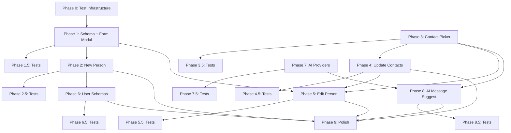

---
tags:
  - projects
  - orbit
  - implementation
created: 2026-02-13
status: planning
---
# Orbit UX Overhaul — Implementation Plan

> **Goal:** Replace manual contact management with native Orbit modals, add a user-extensible schema system, and integrate AI-powered message suggestions.
>
> Each phase is scoped to fit within a single agent session (~1-3 hours of focused work). Phases are sequential — each builds on the previous. Each implementation phase (1-9) is followed by a testing sub-phase (X.5) that adds unit and integration tests targeting **≥80% coverage** on the code introduced in that phase.

---

## Architecture Overview

### Test Infrastructure (see Phase 0)

```
test/
├── setup.ts                         # Global test setup (Obsidian API mocks)
├── mocks/
│   ├── obsidian.ts                  # Mock: App, Vault, MetadataCache, TFile, etc.
│   └── react-dom.ts                 # Mock: createRoot for modal tests
├── helpers/
│   └── factories.ts                 # Test factories for OrbitContact, SchemaDef, etc.
├── unit/
│   ├── types.test.ts                # Phase 0 baseline tests
│   ├── orbit-index.test.ts          # Phase 0 baseline tests
│   ├── schemas/
│   │   ├── types.test.ts            # Phase 1.5
│   │   └── loader.test.ts           # Phase 6.5
│   ├── services/
│   │   ├── contact-manager.test.ts  # Phase 2.5
│   │   └── ai-service.test.ts       # Phase 7.5
│   └── ...
└── integration/
    ├── new-person-flow.test.ts      # Phase 2.5
    ├── update-flow.test.ts          # Phase 4.5
    ├── edit-flow.test.ts            # Phase 5.5
    ├── user-schema-flow.test.ts     # Phase 6.5
    └── ai-suggest-flow.test.ts      # Phase 8.5
```

### Source Structure

```
src/
├── main.ts                          # Plugin entry (add commands)
├── settings.ts                      # Settings tab (expand for AI, schemas)
├── types.ts                         # Core types (extend as needed)
├── schemas/
│   ├── types.ts                     # [NEW] Schema interfaces (FieldDef, SchemaDef)
│   ├── new-person.schema.ts         # [NEW] Built-in: New Person
│   ├── edit-person.schema.ts        # [NEW] Built-in: Edit Person
│   └── loader.ts                    # [NEW] Schema loader (TS + Markdown)
├── modals/
│   ├── OrbitFormModal.ts            # [NEW] Generic schema-driven form modal
│   ├── ContactPickerModal.ts        # [NEW] Card grid picker modal
│   ├── UpdatePanelModal.ts          # [NEW] Inline update panel (used inside picker)
│   └── AiResultModal.ts            # [NEW] AI message result modal
├── services/
│   ├── OrbitIndex.ts                # Existing (no changes expected)
│   ├── LinkListener.ts              # Existing (no changes expected)
│   ├── ContactManager.ts            # [NEW] File creation, frontmatter writes, template engine
│   └── AiService.ts                 # [NEW] AI provider abstraction + generation
├── components/
│   ├── ContactCard.tsx              # Existing (reused in modals)
│   ├── ContactGrid.tsx              # Existing (reused in picker)
│   ├── FormRenderer.tsx             # [NEW] React form renderer (field types)
│   ├── ContactPickerGrid.tsx        # [NEW] Card grid for modal context
│   ├── UpdatePanel.tsx              # [NEW] Inline update form
│   └── AiResult.tsx                 # [NEW] AI result display (copy, regen, dismiss)
├── context/
│   └── OrbitContext.tsx             # Existing (no changes expected)
└── views/
    ├── OrbitView.tsx                # Existing
    └── OrbitDashboard.tsx           # Existing
```

### Key Architecture Decisions

| Decision | Choice |
|----------|--------|
| Modal rendering | Native Obsidian `Modal` subclass → mounts React via `createRoot()` |
| Schema format (built-in) | TypeScript files, compiled with plugin |
| Schema format (user) | Markdown + YAML frontmatter in configurable vault directory |
| Contact picker | Reuses existing `ContactCard` component inside modal |
| Update flow | Click card → inline update panel → save → return to grid |
| AI providers | Ollama (local default), OpenAI, Anthropic, Google, Custom endpoint |
| Source of truth | File frontmatter is canonical; `orbit-state.json` is derived |
| Testing | vitest + Obsidian API mocks, ≥80% coverage per phase, X.5 sub-phases |

---

## Phase 0: Test Infrastructure & Baseline Tests

**Goal:** Set up vitest with Obsidian API mocks and write baseline tests for the most important existing code.

### Deliverables
- Install vitest + dependencies (`vitest`, `@testing-library/react`, `jsdom`, `c8`/`v8` coverage)
- `vitest.config.ts` — Config with jsdom environment, coverage thresholds, path aliases
- `test/setup.ts` — Global setup (DOM polyfills if needed)
- `test/mocks/obsidian.ts` — Mocks for Obsidian API: `App`, `Vault`, `TFile`, `MetadataCache`, `Plugin`, `Modal`, `Notice`, `Menu`, `Events`, `processFrontMatter`, etc.
- `test/helpers/factories.ts` — Factory functions for creating test `OrbitContact`, `TFile`, `CachedMetadata` objects
- `package.json` — Add `test`, `test:coverage` scripts
- `tsconfig.json` — Ensure test files are included in compilation (or separate `tsconfig.test.json`)

### Baseline Tests (Existing Code)

These tests lock down the existing behavior before we start modifying anything:

| Test File | Target | Tests |
|-----------|--------|-------|
| `test/unit/types.test.ts` | `src/types.ts` | `calculateStatus` (all status transitions), `calculateDaysSince`, `calculateDaysUntilDue`, `parseDate` (valid/invalid/edge cases), `isValidFrequency` |
| `test/unit/orbit-index.test.ts` | `src/services/OrbitIndex.ts` | `initialize`, `scanVault`, `parseContact` (valid/missing fields/ignored paths), `hasPersonTag`, `handleFileChange`, `handleFileDelete`, `handleFileRename`, `getContacts`, `getContactsByStatus` |
| `test/unit/link-listener.test.ts` | `src/services/LinkListener.ts` | Debounce behavior, wikilink detection regex, index cross-reference, duplicate detection (same-day), settings update |

### Obsidian Mock Strategy

The Obsidian API can't be imported in tests. We create a mock module that vitest resolves via `moduleNameMapper`:

```typescript
// test/mocks/obsidian.ts
export class Plugin {
  app: any;
  registerEvent() {}
  addCommand() {}
  addSettingTab() {}
  addRibbonIcon() {}
  loadData() { return Promise.resolve({}); }
  saveData() { return Promise.resolve(); }
  registerView() {}
}

export class Events {
  private handlers: Map<string, Function[]> = new Map();
  on(event: string, handler: Function) { /* ... */ }
  trigger(event: string, ...args: any[]) { /* ... */ }
}

export class TFile {
  path: string;
  basename: string;
  extension = 'md';
  constructor(path: string) {
    this.path = path;
    this.basename = path.split('/').pop()?.replace('.md', '') ?? '';
  }
}
// ... Modal, Notice, Menu, Setting, etc.
```

### Files to Create/Modify

| File | Action |
|------|--------|
| `vitest.config.ts` | **NEW** — Test configuration |
| `test/setup.ts` | **NEW** — Global test setup |
| `test/mocks/obsidian.ts` | **NEW** — Obsidian API mocks |
| `test/helpers/factories.ts` | **NEW** — Test data factories |
| `test/unit/types.test.ts` | **NEW** — Baseline: type utilities |
| `test/unit/orbit-index.test.ts` | **NEW** — Baseline: OrbitIndex service |
| `test/unit/link-listener.test.ts` | **NEW** — Baseline: LinkListener service |
| `package.json` | **MODIFY** — Add vitest deps + test scripts |

### Verification
- `npm test` runs all tests and passes
- `npm run test:coverage` produces coverage report
- Baseline tests achieve ≥80% line + branch coverage on `types.ts`, `OrbitIndex.ts`, `LinkListener.ts`
- `npm run build` still succeeds (test files don't break production build)

---

## Phase 1: Schema System & Form Modal Foundation

**Goal:** Build the core infrastructure that all subsequent modals depend on.

### Deliverables
- `schemas/types.ts` — `FieldDef` and `SchemaDef` interfaces
- `modals/OrbitFormModal.ts` — Generic modal shell (extends `Modal`, creates React root)
- `components/FormRenderer.tsx` — React component that renders fields from a schema
- Supported field types: `text`, `textarea`, `dropdown`, `date`, `toggle`, `number`
- CSS: Base form modal styles, layout hints (`full-width`, `half-width`, `inline`), `cssClass` support
- Smoke test: Register a temporary command that opens the form modal with a hardcoded test schema

### Schema Interface (Draft)

```typescript
interface FieldDef {
  key: string;           // frontmatter key
  type: "text" | "textarea" | "dropdown" | "date" | "toggle" | "number" | "photo";
  label: string;         // display label
  placeholder?: string;
  required?: boolean;
  default?: string | boolean | number;
  options?: string[];    // for dropdowns
  layout?: "full-width" | "half-width" | "inline";
  description?: string;  // help text below the field
}

interface SchemaDef {
  id: string;            // unique identifier
  title: string;         // modal title
  cssClass?: string;     // applied to modal container
  fields: FieldDef[];
  submitLabel?: string;  // button text (default: "Save")
  output?: {
    path: string;        // template path for file creation (e.g., "People/{{category}}/{{name}}.md")
  };
}
```

### Files to Create/Modify

| File | Action |
|------|--------|
| `src/schemas/types.ts` | **NEW** — FieldDef, SchemaDef interfaces |
| `src/modals/OrbitFormModal.ts` | **NEW** — Modal shell with React root |
| `src/components/FormRenderer.tsx` | **NEW** — Schema-driven form renderer |
| `styles.css` | **MODIFY** — Add form modal base styles |
| `src/main.ts` | **MODIFY** — Add temp test command (removed in Phase 2) |

### Verification
- Build succeeds (`npm run build`)
- Temporary command opens modal with test schema
- All field types render correctly
- Layout hints apply proper CSS classes
- Modal sizes to content with reasonable min/max dimensions

---

## Phase 1.5: Schema & Form Modal Tests

**Goal:** ≥80% unit + integration coverage on Phase 1 code.

### Test Files

| File | Type | Covers |
|------|------|--------|
| `test/unit/schemas/types.test.ts` | Unit | `FieldDef` and `SchemaDef` validation logic (if any), type guards |
| `test/unit/modals/orbit-form-modal.test.ts` | Unit | `OrbitFormModal` — React root creation, schema rendering delegation, submit callback, close behavior |
| `test/unit/components/form-renderer.test.ts` | Unit | `FormRenderer` — renders each field type, layout classes applied, required field validation, default values, onChange callbacks |
| `test/integration/form-modal-flow.test.ts` | Integration | Full flow: open modal with schema → fill fields → submit → verify callback receives correct data |

### Coverage Targets
- `schemas/types.ts`: ≥80% lines + branches
- `modals/OrbitFormModal.ts`: ≥80% lines + branches
- `components/FormRenderer.tsx`: ≥80% lines + branches

---

## Phase 2: ContactManager Service & New Person Modal

**Goal:** Ship the "New Person" workflow — the highest-value friction removal.

### Deliverables
- `services/ContactManager.ts` — File creation, template loading, frontmatter population
- `schemas/new-person.schema.ts` — Built-in schema for creating a new contact
- `photo` field type in FormRenderer (URL input with live image preview)
- Template engine: Load user-editable template file, inject values via `{{key}}` replacement
- Command: "Orbit: New Person" in command palette + ribbon
- Remove temporary test command from Phase 1

### New Person Schema Fields

| Field | Type | Required | Notes |
|-------|------|----------|-------|
| name | text | ✅ | Used for filename |
| category | dropdown | ✅ | Family, Friends, Work, Community, etc. |
| frequency | dropdown | ✅ | Daily through Yearly |
| social_battery | dropdown | | Charger, Neutral, Drain |
| birthday | date | | MM-DD or YYYY-MM-DD |
| photo | photo | | URL with live preview |
| google_contact | text | | Google Contacts URL |

### ContactManager Responsibilities
- `createContact(schema, formData, templatePath)` — Main entry point
  - Loads template file from vault (falls back to hardcoded default if missing)
  - Populates frontmatter from form data
  - Replaces `{{key}}` placeholders in body
  - Creates file at `output.path` (from schema, with `{{variable}}` path resolution)
  - Returns the created `TFile`
- `updateFrontmatter(file, data)` — Wrapper around `processFrontMatter`
- `appendToInteractionLog(file, entry)` — Appends timestamped entry to interaction log section

### Settings Addition
- `templatePath` setting — Path to the person template file in the vault (default: `System/Templates/Person Template.md`)

### Files to Create/Modify

| File | Action |
|------|--------|
| `src/services/ContactManager.ts` | **NEW** — File creation and template engine |
| `src/schemas/new-person.schema.ts` | **NEW** — New Person schema definition |
| `src/components/FormRenderer.tsx` | **MODIFY** — Add `photo` field type with preview |
| `src/settings.ts` | **MODIFY** — Add `templatePath` setting |
| `src/main.ts` | **MODIFY** — Register "New Person" command, remove test command |
| `styles.css` | **MODIFY** — Photo preview styles |

### Verification
- Build succeeds
- "Orbit: New Person" command opens modal with correct fields
- Photo URL shows live preview after paste
- Submitting creates a properly formatted `.md` file in the right directory
- Created file appears in Orbit sidebar on next index refresh
- Template file is loaded from vault if it exists, default used if missing

---

## Phase 2.5: ContactManager & New Person Tests

**Goal:** ≥80% unit + integration coverage on Phase 2 code.

### Test Files

| File | Type | Covers |
|------|------|--------|
| `test/unit/services/contact-manager.test.ts` | Unit | `createContact` (template loading, fallback to default, frontmatter population, `{{key}}` replacement, path resolution), `updateFrontmatter`, `appendToInteractionLog` |
| `test/unit/schemas/new-person-schema.test.ts` | Unit | Schema definition correctness (all fields present, types correct, required flags) |
| `test/unit/components/form-renderer-photo.test.ts` | Unit | `photo` field type — URL input rendering, live preview on value change, broken URL handling |
| `test/integration/new-person-flow.test.ts` | Integration | Full flow: open New Person modal → fill fields → submit → verify file created with correct frontmatter + body content |

### Coverage Targets
- `services/ContactManager.ts`: ≥80% lines + branches
- `schemas/new-person.schema.ts`: ≥80% lines + branches
- `components/FormRenderer.tsx` (photo additions): maintains ≥80%

---

## Phase 3: Contact Picker Modal

**Goal:** Build the reusable card-grid picker that the Update, Edit, and AI flows all share.

### Deliverables
- `modals/ContactPickerModal.ts` — Modal shell with card grid
- `components/ContactPickerGrid.tsx` — Card grid for modal context (uses `ContactCard`)
- Grid sorted by status: decay → wobble → stable → snoozed
- Optional filter: "Show decaying only" toggle
- Search/filter by name (text input at top)
- Click callback: `onSelect(contact: OrbitContact)` — consumer decides what happens next
- Proper sizing: modal sizes to content, minimum dimensions enforced, max = near full-screen

### Component Architecture

```
ContactPickerModal (Obsidian Modal)
  └── React Root
      └── ContactPickerGrid
          ├── Search/filter bar
          └── Grid of ContactCard components (reused from sidebar)
              └── onClick → calls onSelect callback
```

### Reusing ContactCard
The existing `ContactCard` component currently handles:
- Avatar with photo/initials fallback
- Status ring (color-coded border)
- Name display
- Click to open note
- Right-click context menu
- Hover for FuelTooltip

For the picker context, we need to:
- Disable the "open note" click behavior (replaced by `onSelect`)
- Disable the right-click context menu
- Disable the FuelTooltip hover
- Keep everything else (avatar, status ring, name)
- Add a prop like `mode?: "sidebar" | "picker"` to toggle behaviors

### Files to Create/Modify

| File | Action |
|------|--------|
| `src/modals/ContactPickerModal.ts` | **NEW** — Picker modal shell |
| `src/components/ContactPickerGrid.tsx` | **NEW** — Grid layout for picker |
| `src/components/ContactCard.tsx` | **MODIFY** — Add `mode` prop to toggle sidebar vs picker behavior |
| `styles.css` | **MODIFY** — Picker modal styles, search bar |

### Verification
- Build succeeds
- (Internal) — This modal has no user-facing command yet; will be wired in Phase 4
- Verify manually via temporary command or by calling from Phase 4 work

---

## Phase 3.5: Contact Picker Tests

**Goal:** ≥80% unit + integration coverage on Phase 3 code.

### Test Files

| File | Type | Covers |
|------|------|--------|
| `test/unit/modals/contact-picker-modal.test.ts` | Unit | Modal opens, creates React root, passes contacts to grid, calls `onSelect` callback |
| `test/unit/components/contact-picker-grid.test.ts` | Unit | Renders contact cards, search filtering, status sorting (decay → wobble → stable → snoozed), empty state |
| `test/unit/components/contact-card-modes.test.ts` | Unit | `ContactCard` with `mode="picker"` — click calls `onSelect` (not open note), no context menu, no tooltip |
| `test/integration/picker-flow.test.ts` | Integration | Open picker → search → select contact → verify `onSelect` fires with correct contact |

### Coverage Targets
- `modals/ContactPickerModal.ts`: ≥80% lines + branches
- `components/ContactPickerGrid.tsx`: ≥80% lines + branches
- `components/ContactCard.tsx` (mode changes): maintains ≥80%

---

## Phase 4: Update Contacts Flow

**Goal:** Wire the contact picker to an inline update panel. This replaces QuickAdd for contact updates.

### Deliverables
- `components/UpdatePanel.tsx` — Inline form for logging a contact touchpoint
- `modals/ContactPickerModal.ts` — Extended with two-panel layout: grid ↔ update panel
- Batch mode: after saving an update, modal returns to the card grid (not closed)
- "Done" button to close the modal when finished updating
- Command: "Orbit: Update Contacts" in command palette + ribbon

### Update Panel Fields

| Field | Type | Notes |
|-------|------|-------|
| Last Contact Date | date picker | Defaults to today |
| Interaction Type | dropdown | call, text, in-person, email, other |
| Note | textarea | Optional interaction note |

### Update Flow
1. User runs "Update Contacts" command
2. `ContactPickerModal` opens with full card grid (sorted by decay)
3. User clicks a card → grid slides/transitions to `UpdatePanel` for that contact
4. `UpdatePanel` shows contact info at top (name, photo, current status) + update fields
5. User fills in and clicks "Save"
6. `ContactManager.updateFrontmatter()` sets `last_contact` and `last_interaction`
7. `ContactManager.appendToInteractionLog()` adds timestamped note (if provided)
8. Modal transitions back to the card grid
9. Updated contact's card refreshes to show new status
10. User can update more contacts or click "Done" to close

### Files to Create/Modify

| File | Action |
|------|--------|
| `src/components/UpdatePanel.tsx` | **NEW** — Inline update form |
| `src/modals/ContactPickerModal.ts` | **MODIFY** — Add two-panel routing (grid ↔ update) |
| `src/main.ts` | **MODIFY** — Register "Update Contacts" command |
| `styles.css` | **MODIFY** — Update panel styles, transition between panels |

### Verification
- Build succeeds
- "Orbit: Update Contacts" opens picker modal
- Card grid displays all contacts sorted by status
- Clicking a card transitions to update panel
- Saving an update writes correct frontmatter (`last_contact`, `last_interaction`)
- Interaction log entry is appended to the contact's note
- Modal returns to grid after save
- Updated card reflects new status immediately
- "Done" button closes modal

---

## Phase 4.5: Update Contacts Tests

**Goal:** ≥80% unit + integration coverage on Phase 4 code.

### Test Files

| File | Type | Covers |
|------|------|--------|
| `test/unit/components/update-panel.test.ts` | Unit | Renders contact info, date defaults to today, interaction type dropdown, note textarea, submit callback, cancel/back button |
| `test/unit/modals/contact-picker-update.test.ts` | Unit | Two-panel routing — grid state vs update state, transitions between panels, Done button closes modal |
| `test/integration/update-flow.test.ts` | Integration | Full flow: open picker → select contact → fill update panel → save → verify frontmatter updated + interaction log appended → verify returns to grid |

### Coverage Targets
- `components/UpdatePanel.tsx`: ≥80% lines + branches
- `modals/ContactPickerModal.ts` (update extensions): maintains ≥80%
- `services/ContactManager.ts` (updateFrontmatter, appendToInteractionLog): maintains ≥80%

---

## Phase 5: Edit Person & Update This Person

**Goal:** Ship the remaining two contact management commands.

### Deliverables

#### Edit Person
- `schemas/edit-person.schema.ts` — Schema matching the New Person fields (same fields, pre-populated)
- Reuses `OrbitFormModal` — opens with existing frontmatter values pre-filled
- On submit: writes updated frontmatter back to the same file (no new file creation)
- Flow: Command palette → `ContactPickerModal` (select who to edit) → `OrbitFormModal` (pre-filled)
- Command: "Orbit: Edit Person"

#### Update This Person
- Detects the currently active file
- Checks if it's in the `OrbitIndex` (is it a person file?)
- If yes: opens `UpdatePanel` directly for that contact (skips the picker)
- If no: shows `Notice` — "Current file is not a tracked contact"
- Command: "Orbit: Update This Person"

### Files to Create/Modify

| File | Action |
|------|--------|
| `src/schemas/edit-person.schema.ts` | **NEW** — Edit Person schema |
| `src/modals/OrbitFormModal.ts` | **MODIFY** — Support pre-populating fields from existing data |
| `src/modals/ContactPickerModal.ts` | **MODIFY** — Support "edit" callback mode |
| `src/main.ts` | **MODIFY** — Register both commands |

### Verification
- Build succeeds
- "Orbit: Edit Person" → picker → form with pre-filled data → saves frontmatter
- "Orbit: Update This Person" with person file open → update panel opens directly
- "Orbit: Update This Person" with non-person file → shows notice
- Frontmatter changes persist correctly after edit

---

## Phase 5.5: Edit & Update This Person Tests

**Goal:** ≥80% unit + integration coverage on Phase 5 code.

### Test Files

| File | Type | Covers |
|------|------|--------|
| `test/unit/schemas/edit-person-schema.test.ts` | Unit | Schema fields match new-person schema, all fields present |
| `test/unit/modals/orbit-form-modal-prefill.test.ts` | Unit | Pre-population logic — existing frontmatter values appear in form fields, modified values submitted correctly |
| `test/unit/commands/update-this-person.test.ts` | Unit | Active file detection, person file → opens update panel, non-person file → shows Notice |
| `test/integration/edit-flow.test.ts` | Integration | Full flow: picker → select → edit form pre-filled → modify → save → verify frontmatter changed |

### Coverage Targets
- `schemas/edit-person.schema.ts`: ≥80% lines + branches
- `modals/OrbitFormModal.ts` (pre-fill additions): maintains ≥80%
- "Update This Person" command logic: ≥80%

---

## Phase 6: User Schema System

**Goal:** Allow users to create their own schemas as Markdown files in the vault.

### Deliverables
- `schemas/loader.ts` — Schema loader that reads both TypeScript (built-in) and Markdown (user) schemas
- Markdown schema parser: reads YAML frontmatter for field definitions, body as output template
- Schema validation: helpful error notices for malformed schemas
- Schema registry: merged list of built-in + user schemas
- Settings: configurable schema folder path (default: `System/Orbit/Schemas/`)
- "Generate Example Schema" button in settings — creates a template markdown file with all field types
- Command: "Orbit: New Contact from Schema" — opens a picker to select which schema, then the form

### User Schema Format

```markdown
---
schema_id: conference-contact
schema_title: Add Conference Contact
cssClass: orbit-conference
fields:
  - key: name
    type: text
    label: Name
    required: true
  - key: company
    type: text
    label: Company
output:
  path: "People/Professional/{{name}}.md"
---
# {{name}}

> Company: {{company}}

## Notes
- 
```

### Schema Loader Logic
1. On plugin load, scan configured schema folder for `.md` files
2. Parse each file's YAML frontmatter into a `SchemaDef`
3. Validate field definitions (known types, required fields present, etc.)
4. Merge with built-in schemas into a unified registry
5. Re-scan when settings change or files in schema folder change

### Files to Create/Modify

| File | Action |
|------|--------|
| `src/schemas/loader.ts` | **NEW** — Dual-format schema loader + validator |
| `src/settings.ts` | **MODIFY** — Add schema folder path, "Generate Example" button |
| `src/main.ts` | **MODIFY** — Register "New Contact from Schema" command, initialize loader |
| `styles.css` | **MODIFY** — Styles for schema picker (if needed) |

### Verification
- Build succeeds
- Place a test schema `.md` in the configured folder → it appears in the schema picker
- Creating a contact from a user schema produces correctly formatted output
- Malformed YAML shows a helpful error notice (not a crash)
- "Generate Example Schema" creates a working template file
- Built-in schemas still work alongside user schemas

---

## Phase 6.5: User Schema System Tests

**Goal:** ≥80% unit + integration coverage on Phase 6 code.

### Test Files

| File | Type | Covers |
|------|------|--------|
| `test/unit/schemas/loader.test.ts` | Unit | Parse valid markdown schema, parse invalid/malformed YAML (error handling), merge built-in + user schemas, re-scan on settings change, field type validation, missing required fields |
| `test/unit/settings/schema-settings.test.ts` | Unit | Schema folder path setting, "Generate Example" button creates file |
| `test/integration/user-schema-flow.test.ts` | Integration | Full flow: create schema file → loader picks it up → use schema in "New Contact from Schema" → verify output file |

### Coverage Targets
- `schemas/loader.ts`: ≥80% lines + branches
- Settings additions: ≥80%

---

## Phase 7: AI Provider Architecture

**Goal:** Build the AI provider abstraction layer and settings UI. No user-facing AI feature yet — just the plumbing.

### Deliverables
- `services/AiService.ts` — Provider interface + implementations
- Provider: **Ollama** — auto-detect via `GET http://localhost:11434/`, list installed models, generate
- Provider: **OpenAI** — API key auth, curated model list, generate via chat completions API
- Provider: **Anthropic** — API key auth, curated model list, generate via messages API
- Provider: **Google (Gemini)** — API key auth, curated model list, generate via Gemini API
- Provider: **Custom Endpoint** — user-provided URL + API key + model name
- Settings UI: Provider selector dropdown, provider-specific config fields (API key, model selector)
- Mobile detection: Ollama option hidden on mobile, defaults to cloud provider
- Default prompt template stored in settings (editable, with reset-to-default)

### Provider Interface

```typescript
interface AiProvider {
  id: string;
  name: string;
  isAvailable(): Promise<boolean>;
  listModels(): Promise<string[]>;
  generate(prompt: string, model: string): Promise<string>;
}
```

### Settings Additions

| Setting | Type | Notes |
|---------|------|-------|
| AI Provider | dropdown | Ollama, OpenAI, Anthropic, Google, Custom |
| API Key | text (password) | Per-provider, only shown for cloud providers |
| Model | dropdown | Populated from provider's model list |
| Prompt Template | textarea | Default shipped, editable, reset button |
| Custom Endpoint URL | text | Only shown when "Custom" selected |

### Files to Create/Modify

| File | Action |
|------|--------|
| `src/services/AiService.ts` | **NEW** — Provider interface + all implementations |
| `src/settings.ts` | **MODIFY** — AI provider settings section |
| `src/types.ts` | **MODIFY** — Add AI-related settings types |

### Verification
- Build succeeds
- Settings UI shows provider dropdown with all options
- Selecting a provider shows its specific config fields
- On mobile, Ollama option is hidden
- (Provider connectivity tested in Phase 8 with a real request)

---

## Phase 7.5: AI Provider Tests

**Goal:** ≥80% unit + integration coverage on Phase 7 code.

### Test Files

| File | Type | Covers |
|------|------|--------|
| `test/unit/services/ai-service.test.ts` | Unit | Provider interface compliance for all 5 providers, Ollama `isAvailable` (mock HTTP), `listModels` (mock response), `generate` (mock response + error), OpenAI/Anthropic/Google API key validation, request formatting, error handling, Custom endpoint URL handling |
| `test/unit/settings/ai-settings.test.ts` | Unit | Provider dropdown rendering, conditional field visibility (API key shown for cloud only, Ollama hidden on mobile), prompt template textarea, reset-to-default button |
| `test/integration/ai-provider-flow.test.ts` | Integration | Select provider → configure → verify `generate()` builds correct request payload (mocked HTTP, not real API calls) |

### Coverage Targets
- `services/AiService.ts`: ≥80% lines + branches
- AI settings additions: ≥80%

> [!NOTE]
> All provider tests use mocked HTTP — no real API calls. We test request formatting, response parsing, and error handling, not actual LLM connectivity.

---

## Phase 8: AI Message Suggest Feature

**Goal:** Ship the complete AI message suggestion flow.

### Deliverables
- `modals/AiResultModal.ts` — Result display modal (extends `Modal`, React root)
- `components/AiResult.tsx` — React component: suggested message, Copy button, Regenerate button, Dismiss
- Context extraction: reads contact's `.md` file, pulls Conversational Fuel, Small Talk Data, last interaction, days since contact, category, battery type
- Prompt assembly: fills the prompt template with extracted context
- Generation: calls `AiService.generate()` with assembled prompt
- Loading state: spinner/skeleton while waiting for response
- Error handling: clear notices for "Ollama not running", "API key invalid", "model not found", etc.
- Command: "Orbit: Suggest Message" — opens contact picker → generates → shows result

### Flow
1. User runs "Orbit: Suggest Message"
2. `ContactPickerModal` opens (decay-first sorting)
3. User selects a contact
4. Plugin reads contact's full `.md` file content
5. Extracts structured context (fuel, small talk, last interaction, etc.)
6. Assembles prompt from template + context
7. Calls `AiService.generate()`
8. Opens `AiResultModal` with:
   - Contact name/photo at top
   - Generated message in a styled box
   - **Copy to Clipboard** button
   - **Regenerate** button (re-generates with same context)
   - **Dismiss** button

### Context Extraction

```typescript
interface MessageContext {
  name: string;
  category: string;
  daysSinceContact: number;
  socialBattery: string;
  conversationalFuel: string;   // Parsed from ## Conversational Fuel
  smallTalkData: string;        // Parsed from ## Small Talk Data
  lastInteraction: string;      // Date + type + note if available
}
```

### Files to Create/Modify

| File | Action |
|------|--------|
| `src/modals/AiResultModal.ts` | **NEW** — Result modal shell |
| `src/components/AiResult.tsx` | **NEW** — Result display component |
| `src/services/AiService.ts` | **MODIFY** — Add context extraction + prompt assembly |
| `src/main.ts` | **MODIFY** — Register "Suggest Message" command |
| `styles.css` | **MODIFY** — AI result modal styles |

### Verification
- Build succeeds
- "Orbit: Suggest Message" → picker → loading → result modal
- Copy to clipboard works
- Regenerate produces a new message
- Dismiss closes modal
- Error states: Ollama not running shows helpful notice, bad API key shows notice
- Prompt template from settings is used (not hardcoded)

---

## Phase 8.5: AI Message Suggest Tests

**Goal:** ≥80% unit + integration coverage on Phase 8 code.

### Test Files

| File | Type | Covers |
|------|------|--------|
| `test/unit/services/ai-context.test.ts` | Unit | Context extraction — parses Conversational Fuel section, Small Talk Data section, handles missing sections, assembles `MessageContext` correctly |
| `test/unit/services/ai-prompt.test.ts` | Unit | Prompt assembly — template variable replacement, all `{{variables}}` filled, custom template used from settings |
| `test/unit/modals/ai-result-modal.test.ts` | Unit | Modal opens with result, copy-to-clipboard, regenerate callback, dismiss closes modal, loading state |
| `test/unit/components/ai-result.test.ts` | Unit | Renders message text, contact info header, all three buttons functional |
| `test/integration/ai-suggest-flow.test.ts` | Integration | Full flow: select contact → extract context → assemble prompt → mock generate → display result → copy → verify clipboard |

### Coverage Targets
- `services/AiService.ts` (context + prompt additions): maintains ≥80%
- `modals/AiResultModal.ts`: ≥80% lines + branches
- `components/AiResult.tsx`: ≥80% lines + branches

---

## Phase 9: Polish, Integration & Final Settings

**Goal:** Final pass — wire everything together, polish UX, handle edge cases.

### Deliverables
- Ribbon icon menu: single "Orbit" ribbon icon with dropdown for all commands (New Person, Update, Edit, Suggest Message, Weekly Digest)
- Command palette: all commands properly named and grouped
- CSS polish: consistent spacing, transitions between modal panels, dark/light theme compatibility
- Error boundaries: React `ErrorBoundary` in all modal React roots
- Edge cases:
  - Template file doesn't exist → create default + notify user
  - Schema folder doesn't exist → create it on first use
  - No contacts in vault → empty state messaging in picker
  - Contact file deleted while modal is open → graceful handling
- Performance: schema loader caching, avoid re-parsing on every modal open
- Documentation: Update `CLAUDE.md`, `Handoff Log.md`, `Feature Priority List.md`

### Files to Create/Modify

| File | Action |
|------|--------|
| `src/main.ts` | **MODIFY** — Ribbon dropdown, command cleanup |
| `styles.css` | **MODIFY** — Final polish pass |
| All modal/component files | **MODIFY** — Error boundaries, edge case handling |
| `docs/Handoff Log.md` | **MODIFY** — Add session log entries |
| `docs/Feature Priority List.md` | **MODIFY** — Mark features complete |
| `CLAUDE.md` | **MODIFY** — Update project structure, add new patterns |

### Verification
- Full build succeeds
- All commands work from command palette
- Ribbon dropdown shows all options
- Dark mode and light mode look correct
- All empty states display properly
- No crashes on missing files/folders
- Complete end-to-end flow: create person → update → edit → AI suggest

---

## Phase Summary

| Phase | Focus | Key Deliverables | Est. Complexity |
|-------|-------|-----------------|------------------|
| **0** | **Test Infrastructure** | vitest, Obsidian mocks, baseline tests | Medium |
| 1 | Schema + Form Modal | Schema types, generic form modal, field renderers | Medium |
| 1.5 | Schema/Modal Tests | Unit + integration tests for Phase 1 | Low-Medium |
| 2 | New Person | ContactManager service, template engine, photo preview | Medium |
| 2.5 | New Person Tests | Unit + integration tests for Phase 2 | Low-Medium |
| 3 | Contact Picker | Reusable card-grid picker modal, search/filter | Medium |
| 3.5 | Picker Tests | Unit + integration tests for Phase 3 | Low-Medium |
| 4 | Update Contacts | Inline update panel, batch updates, interaction log | Medium |
| 4.5 | Update Tests | Unit + integration tests for Phase 4 | Low-Medium |
| 5 | Edit + Update This | Pre-populated edit form, active-file detection | Low-Medium |
| 5.5 | Edit/Update Tests | Unit + integration tests for Phase 5 | Low-Medium |
| 6 | User Schemas | Markdown schema loader, validation, settings | Medium |
| 6.5 | User Schema Tests | Unit + integration tests for Phase 6 | Low-Medium |
| 7 | AI Providers | Provider abstraction, 5 providers, settings UI | Medium-High |
| 7.5 | AI Provider Tests | Unit + integration tests for Phase 7 | Medium |
| 8 | AI Message Suggest | Context extraction, prompt assembly, result modal | Medium |
| 8.5 | AI Suggest Tests | Unit + integration tests for Phase 8 | Low-Medium |
| 9 | Polish & Integration | Ribbon menu, error boundaries, edge cases, docs | Low-Medium |

---

## Dependencies Between Phases



> **Note:** Phases 1-5 (modal system) and Phases 7-8 (AI) are two independent tracks. Phase 6 (user schemas) depends on Phase 2. Phase 9 depends on everything. Each X.5 testing phase must be completed before moving to the next implementation phase.

---

## Verification Strategy

Every phase uses a three-layer verification approach:

1. **Build verification** — `npm run build` must succeed with no TypeScript errors
2. **Automated tests** — `npm test` must pass. Coverage checked via `npm run test:coverage`
3. **Manual verification** — Brad deploys to vault (`npm run deploy`) and exercises the feature in Obsidian

### Coverage Requirements

| Metric | Target | Enforced By |
|--------|--------|-------------|
| Line coverage (per phase) | ≥80% | `npm run test:coverage` |
| Branch coverage (per phase) | ≥80% | `npm run test:coverage` |
| All tests passing | 100% | `npm test` |

### Test Commands

```bash
npm test                    # Run all tests
npm run test:coverage       # Run with coverage report
npm run test -- --watch     # Watch mode during development
```

### Testing Convention
- **Unit tests**: Test individual functions/components in isolation with mocked dependencies
- **Integration tests**: Test complete user flows (open modal → interact → verify outcome) with mocked Obsidian API but real component wiring
- **Test file naming**: `[source-file-name].test.ts` (unit) or `[flow-name]-flow.test.ts` (integration)
- **Factory functions**: Use `test/helpers/factories.ts` for consistent test data creation

---

*Created: 2026-02-13 | Status: Planning | Author: Agent*
